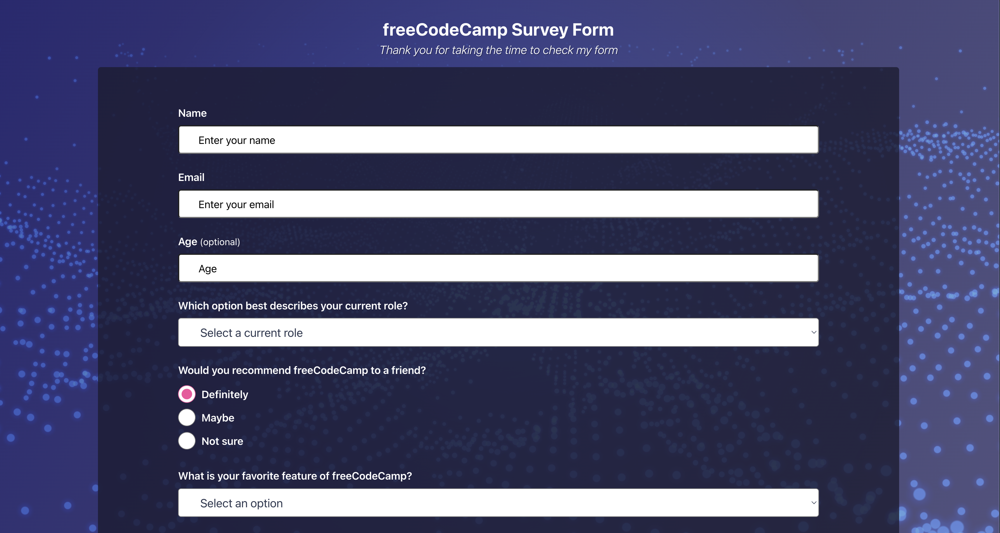

# FreeCodeCamp Survey Form

<!-- PROJECT BADGES -->

  

## Prerequisites

Make sure you have the following installed on your system:

- **Node.js**: `16`

## Project Overview

A responsive survey form built as part of the FreeCodeCamp Responsive Web Design certification. This project demonstrates modern React development practices using Emotion for CSS-in-JS styling, creating an interactive and accessible form with various input types including text fields, dropdowns, radio buttons, and checkboxes.

**Built with ❤️ by [Maksym Galchenko](https://github.com/maxgalchenko)**

